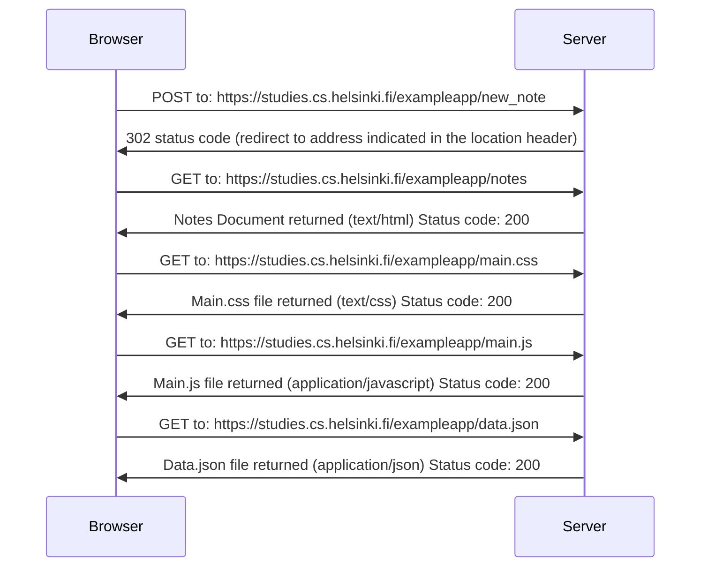

```mermaid
    sequenceDiagram
    participant Browser
    participant Server

    Browser->>Server: POST to: https://studies.cs.helsinki.fi/exampleapp/new_note
    Server->>Browser: 302 status code (redirect to address indicated in the location header)
    Browser->>Server: GET to: https://studies.cs.helsinki.fi/exampleapp/notes 
    Server->>Browser: Notes Document returned (text/html) Status code: 200

    Browser->>Server: GET to: https://studies.cs.helsinki.fi/exampleapp/main.css
    Server->>Browser: Main.css file returned (text/css) Status code: 200

    Browser->>Server: GET to: https://studies.cs.helsinki.fi/exampleapp/main.js
    Server->>Browser: Main.js file returned (application/javascript) Status code: 200

    Browser->>Server: GET to: https://studies.cs.helsinki.fi/exampleapp/data.json
    Server->>Browser: Data.json file returned (application/json) Status code: 200

```