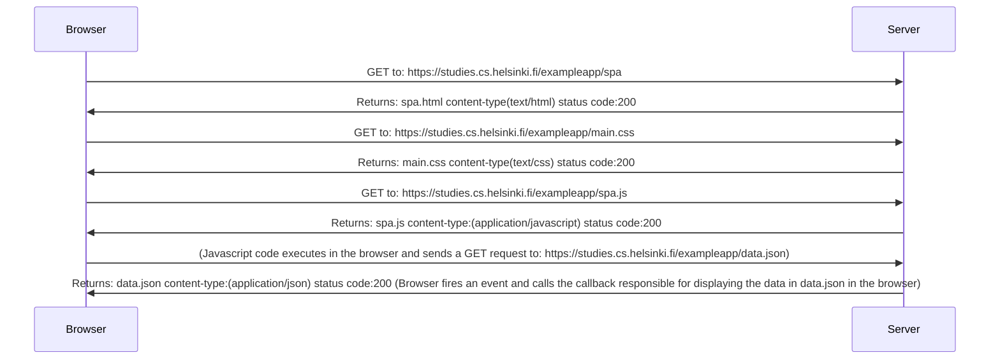

```mermaid
sequenceDiagram
    participant Browser
    participant Server

    Browser->>Server: GET to: https://studies.cs.helsinki.fi/exampleapp/spa

    Server->>Browser: Returns: spa.html content-type(text/html) status code:200

    Browser->>Server: GET to: https://studies.cs.helsinki.fi/exampleapp/main.css

    Server->>Browser: Returns: main.css content-type(text/css) status code:200

    Browser->>Server: GET to: https://studies.cs.helsinki.fi/exampleapp/spa.js

    Server->>Browser: Returns: spa.js content-type:(application/javascript) status code:200

    Browser->>Server: (Javascript code executes in the browser and sends a GET request to: https://studies.cs.helsinki.fi/exampleapp/data.json)

    Server->>Browser: Returns: data.json content-type:(application/json) status code:200 (Browser fires an event and calls the callback responsible for displaying the data in data.json in the browser)

    
    
```  