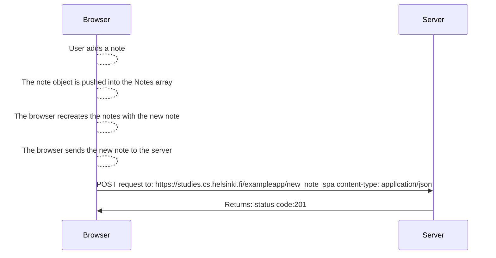

```mermaid
sequenceDiagram
    participant Browser
    participant Server

    Browser-->Browser: User adds a note
    Browser-->Browser: The note object is pushed into the Notes array
    Browser-->Browser: The browser recreates the notes with the new note
    Browser-->Browser: The browser sends the new note to the server

    Browser->>Server: POST request to: https://studies.cs.helsinki.fi/exampleapp/new_note_spa content-type: application/json

    Server->>Browser: Returns: status code:201


``` 